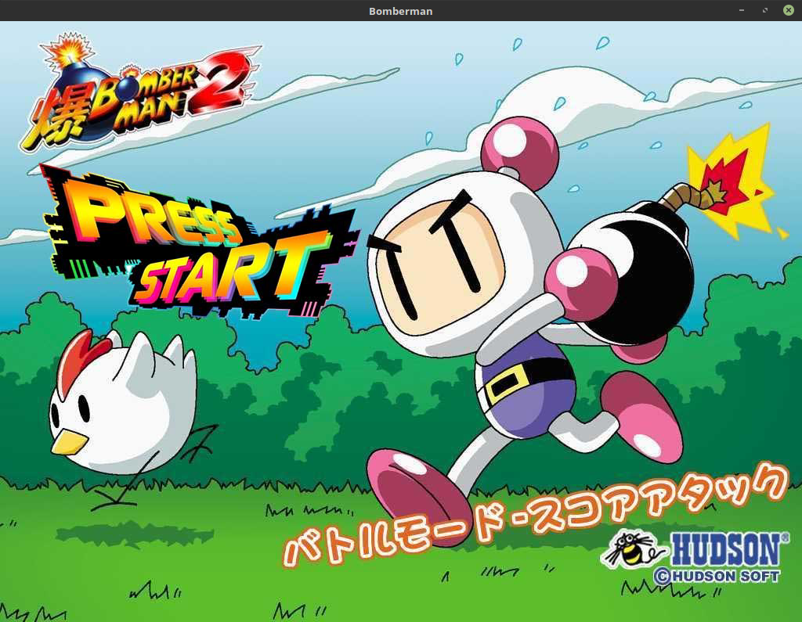
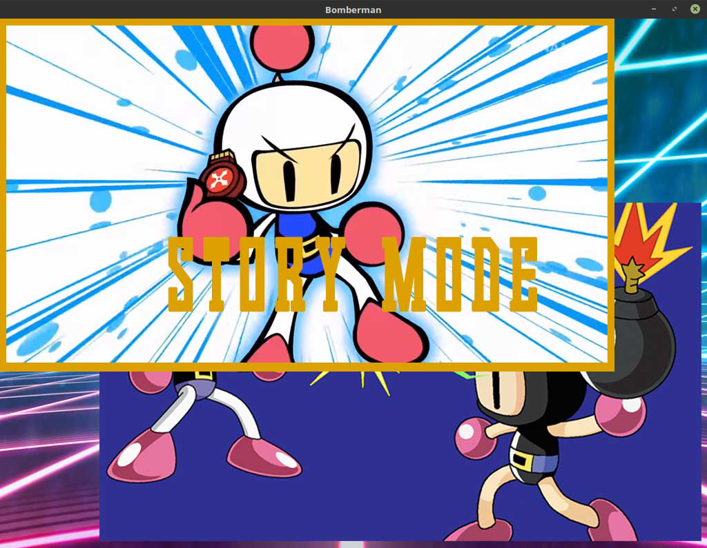
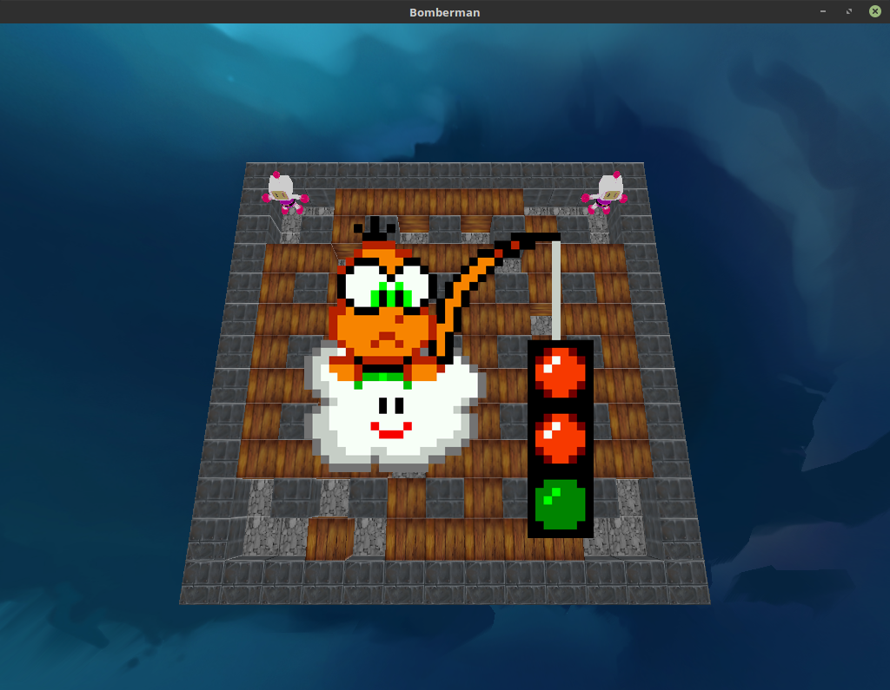
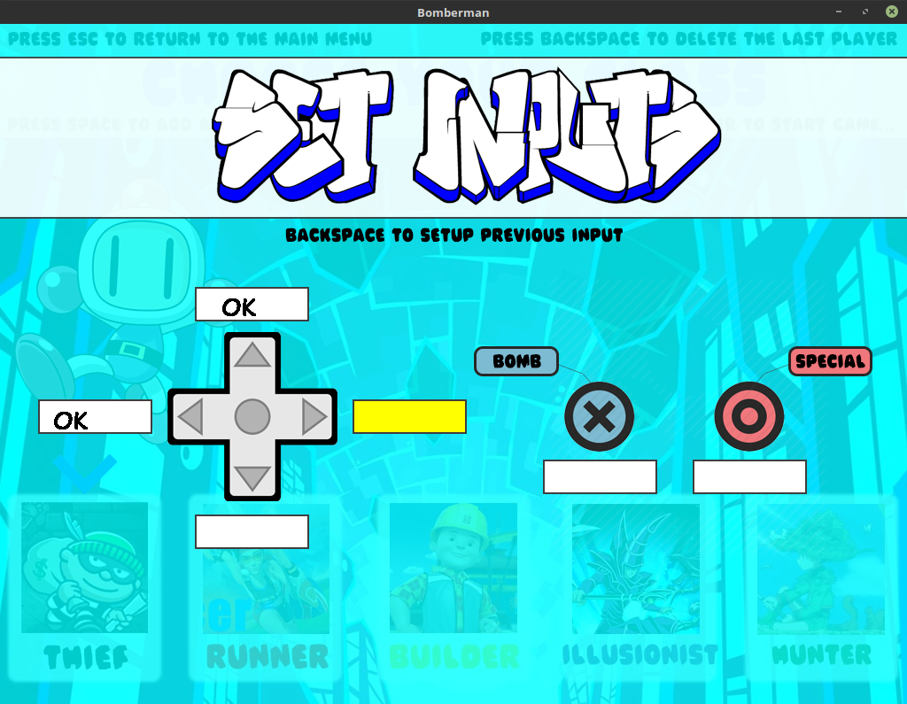
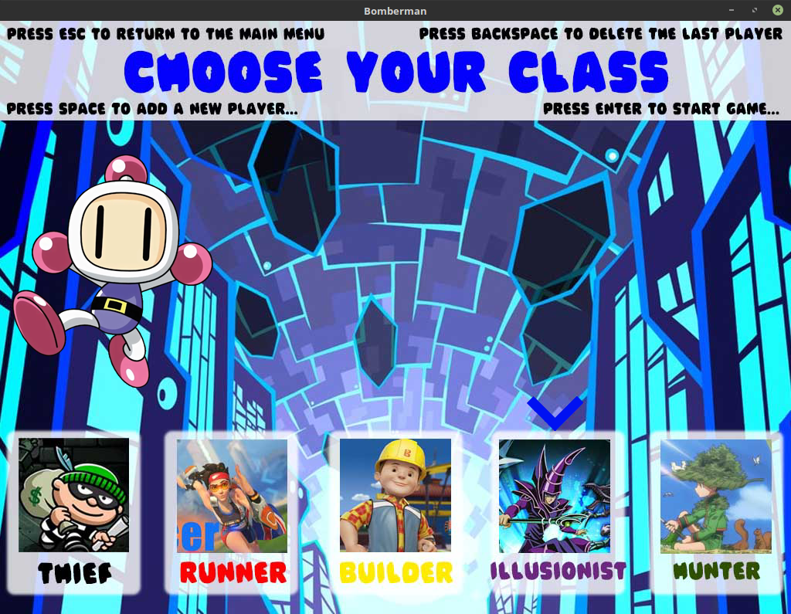
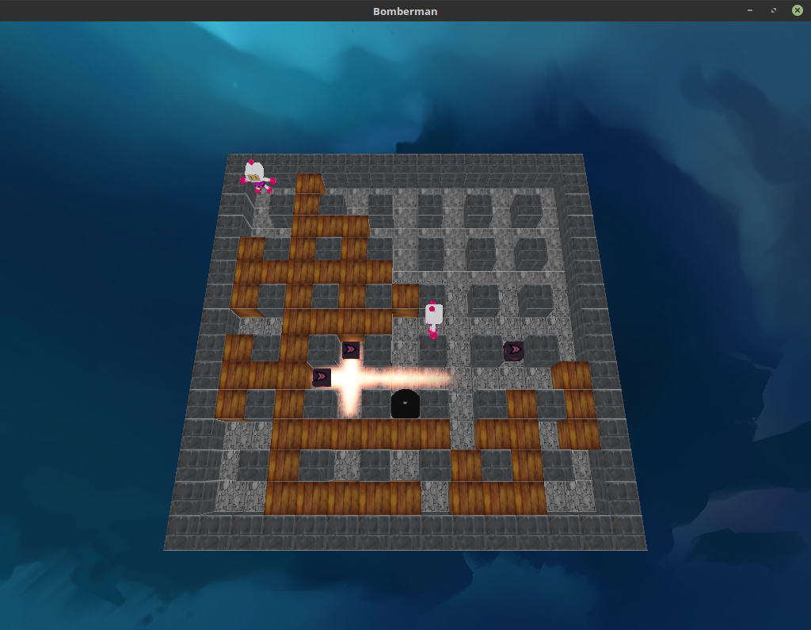
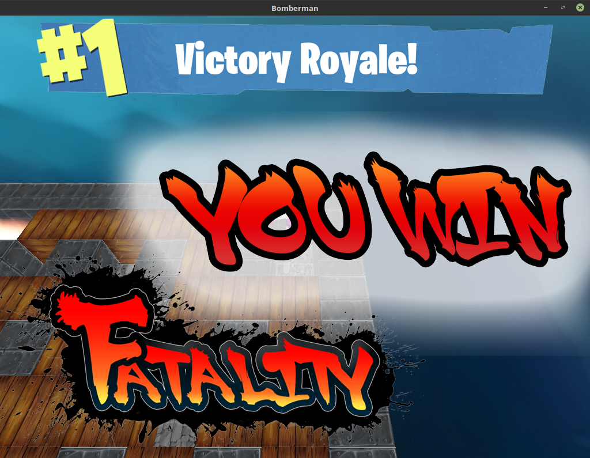

# Bomberman

## Sujet

Projet Indie Studio dans le cadre d'Epitech Paris.
Le projet consiste à réaliser un jeu inspiré de la célèbre série Bomberman de Hudson Soft.
L'objectif visé ici, est de nous apprendre à réaliser un jeu ainsi qu'un début de moteur de jeu.

[Sujet PDF](B-CPP-401_indie.pdf)

Vidéo de démonstration dans /videos.

### Contraintes

Notre moteur de jeux doit être capable de gérer des modèles 2D\3D ainsi que des sons et prendre en charge les touches du clavier.
Même si nous avons réalisé un bomberman il faut garder à l'esprit que le jeu est séparer de l'engine et qu'il est tout à fait possible de s'en servir pour d'autres jeux.
L'utilisation de l'[Irrlicht Engine](http://irrlicht.sourceforge.net) pour la partie graphique est obligatoire.

### Fonctionnement

Notre moteur à était mis en place en singleton pour être accessible partout et ainsi faire appelle à ses fonctionnalités.
Notre engine est un singleton, il est donc accessible depuis les fichiers ayant son header.
Pour réaliser un objet affichable, il faudra hériter l'un de nos 3 types d'objets, un pour les images 2D, un pour les modèles 3D et le dernier pour les textes.
Une fois l'objet créé et initialisé avec les bons paramètres (emplacement de la ressource à charger, place de l'objet dans la fenêtre...) il suffit de le donner à l'engine pour qu'il l'affiche.
Si des animations sont ajoutées, le moteur se chargera de les jouées.
Il suffit alors de créer le jeu en faisant bien hériter les objets du jeu les classes de l'engine et le tout fonctionnera.
Pour les musiques, nous en avons de 2 types. Les son court, mais il est possible d'en jouer plusieurs à la fois, et les sons longs, répétables, mis en pause possible, etc.
Pour jouer un son, il suffit de l'ajouter par les fonctions correspondantes dans l'engine, de stoker l'id ainsi retourné, puis d'appeler la fonction de lecture de son avec l'id en paramètre.
Pour simplifier la tache nous avons aussi fait des classes n'ayant que la fonction play à utiliser depuis l'objet, la classe se charge de stoker les id en évitant les doublons.

### Fonctionnalités

* Images 2D
* Images 3D
* Textes
* Particules
* Sons
* Mouvement de caméra
* Clavier/Manettes
* Multijoueur (4 joueur max, local)

### Jeu

N'oubliez pas d'activer le son ;).
Il est possible de passer l'écran de chargement en appuyant sur une touche.

Haut ou bas pour choisir votre mode de jeux.
Le mode story permet de jouer contre une IA.
Le mode versus permet de jouer contre d'autres joueurs.

Dans le mode versus appuyez sur espace pour ajouter des joueurs.
Pour chaque nouveau joueur, il lui faudra choisir ses touches.
Appuyez simplement sur les touches que vous souhaitez utiliser.
Appuyer sur backspace pour annuler la dernière touche.

Appuyez sur gauche ou droite pour choisir votre classe.
Les classes ont chacun un pouvoir spécial, pouvoir activable en appuyant sur la touche spéciale.
Attention aux délais de récupération !
*Voleur : Pas encore disponible.
*Runner : Cour plus vite pendant une certaine durée.
*Builder : Capable de contruire des murs
*Illusioniste : Appuyez une fois pour poser un téléporteur. Ré appuyer pour vous téléporter ou alors vous serez téléporter automatiquement au bout de 15 secondes.
*Hunter : Déposez un piège invisible qui immobilise tout joueurs passant dessus.

Appuyez sur échap pour repartir à l'écran de démarage.

### Problèmes rencontrés
Ayant plusieurs projets en parallèle le temps disponible pour le projet était alors assez réduit.
Nous avons eux certains problèmes avec des membres d'équipe absents, mais nous avons réussi à nous répartir leur charge.
Malheureusement même si les animations sont gérées, les modèles que nous avons réalisés ne disposent pas d'animations.
Il est possible d'utiliser les modèles de base d'Irrlicht, mais pour le rendu final nous avons préférer rester dans l'esprit d'un bomberman et donc d'utiliser nos modèles.